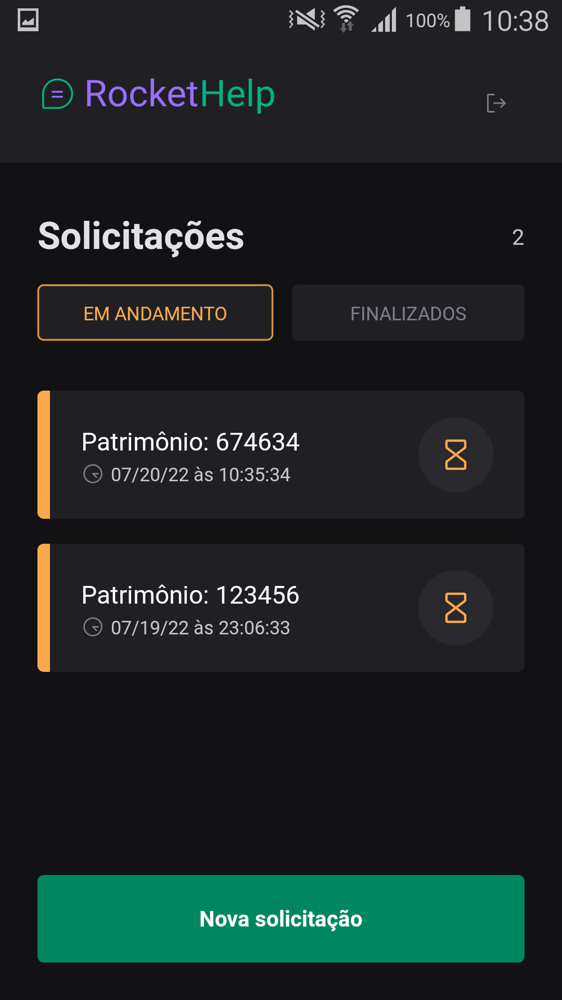

<p align="center">
  
</p>

<p align="center">
    <strong>Aplicativo para controle de solicitações.</strong>
</p>

<p align="center">
  
  
  
  
</p>

<p align="center">
 <a href="#-sobre-o-projeto">Sobre</a> •
 <a href="#-funcionalidades">Funcionalidades</a> • 
 <a href="#-layout">Layout</a> • 
 <a href="#-tecnologias-utilizadas">Tecnologias</a> • 
 <a href="#-instalação-e-uso">Instalação</a> • 
 <a href="#-licença">Licença</a>
</p>

<h4 align="center"> 
	🚧  Projeto finalizado 🚀 🚧
</h4>

## 💻 Sobre o projeto

RocketHelp foi criado durante o Ignite Lab de React Native da Rocketseat.

## 🎨 Layout

<p align="left">       
  
  
</p>

## 🔨 Tecnologias utilizadas

As seguintes ferramentas foram usadas na construção do projeto:

- **[React Native](https://reactnative.dev/)**
- **[TypeScript](https://www.typescriptlang.org/)**
- **[Native Base](https://nativebase.io/)**
- **[React Navigation](https://reactnavigation.org/)**
- **[React Native Firebase](https://rnfirebase.io/)**

> Veja o arquivo [package.json](https://github.com/viniciussgp/rockethelp/blob/main/package.json)

## 🚀 Instalação e uso

```bash
# Clone o repositório
git clone https://github.com/viniciussgp/rockethelp.git
# Acesse a pasta do projeto
cd rockethelp
# Instale as dependências
expo install
# Execute a aplicação
expo start
```


## 📝 Licença

<a href="https://opensource.org/licenses/MIT">
    
</a>

Esse projeto está sob a licença MIT. Veja o arquivo [LICENSE](./LICENSE.md) para mais detalhes.

---

Feito com 💜 por [Vinícius Alves](https://github.com/viniciussgp)